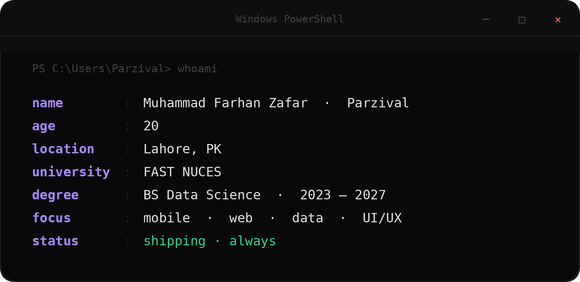

# Muhammad Farhan Zafar

 

 

---

## 🚀 &nbsp;featured projects

 

<table border="0" width="100%">
<tr>
<td width="50%" valign="top">

### ⚡ FlexPrime
**Academic Companion for FASTians**

`React Native` `Expo` `Supabase`

> Solo-built, live on GitHub Releases. Replaces the official FAST-NUCES Flex portal with marks analytics, attendance risk tracking, timetable export, past papers hub, teacher reviews, GPA calculators, and more — built late nights between exams.

**highlights**
- 📊 Live marks diff — notified when new marks post
- 🎯 Attendance risk + bunk/needed calculators
- 📚 Materials hub — past papers, notes, outlines
- 🧮 SGPA/CGPA approximation the portal won't give you
- 🎨 Custom accent colors, font scaling, concise UI mode

</td>
<td width="50%" valign="top">

### 🗒 NotePrime
**Material You Fork of Note Safe**

`Flutter` `Supabase` `Libsodium`

> A ground-up Material 3 redesign of the open-source Note Safe app. End-to-end encrypted, local-first, with a fully overhauled UI — asymmetric chat bubbles, panorama-aware media viewer, per-group privacy shield, biometric grace periods, and Google Fonts integration.

**highlights**
- 🎨 Full Material You dynamic color engine
- 🔒 App-Lock Shield + screenshot blocking
- 👁 Per-group blur privacy shield
- 📸 Edge-to-edge media with 10× pinch zoom
- 🔤 Custom typography via Google Fonts

</td>
</tr>
</table>

 

<table border="0" width="100%">
<tr>
<td width="50%" valign="top">

### 🏛 Smart University Hub
`React` `Node.js` `Express` `MSSQL`

> Full-stack web platform for managing university academics, events, and campus resources. REST backend with a student-first frontend.

</td>
<td width="50%" valign="top">

### 🎓 University Flex Portal
`Java` `JavaScript` `CSS`

> Web app for university flex management — streamlined UX over the default portal with cleaner data flows and improved accessibility.

</td>
</tr>

<tr>
<td width="50%" valign="top">

### 🖥 Smart University Hub — Desktop
`C#` `WinUI`

> Native Windows companion to the web platform. Offline-capable, faster, and purpose-built for the desktop workflow.

</td>
<td width="50%" valign="top">

### ⏱ Timers Management App
`React Native`

> Android app for managing multiple simultaneous timers. Reliable notifications, clean UI, zero bloat.

</td>
</tr>
</table>

 

---

## 🎨 &nbsp;what i do

 

---

## ⚙️ &nbsp;tech stack

**languages**

**mobile**

**web & backend**

**data & databases**

**tools**

 

---

## 📊 &nbsp;github stats

 

## 📡 &nbsp;activity

 

---

every pixel intentional &nbsp;·&nbsp; every commit counts &nbsp;·&nbsp; every detail ships

  

