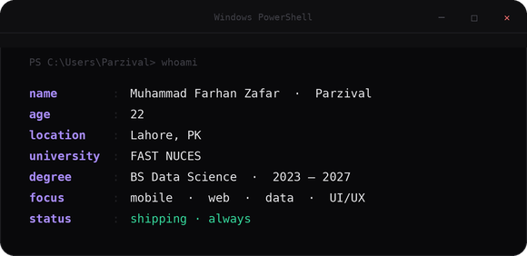

# Muhammad Farhan Zafar

 

 

---

## 🚀 &nbsp;Featured Projects

 

## 📱 Mobile Apps

<table border="0" cellspacing="12" width="100%">
<tr>
<td width="50%" valign="top" style="border:1px solid #1e1e22;border-radius:14px;background:#0d0d0f;padding:20px;">

<h3 style="margin:0 0 2px;">⚡ FlexPrime</h3>
<i>Academic Companion for FASTians</i>

  

  

<code>React Native</code> &nbsp; <code>Expo</code> &nbsp; <code>Supabase</code>

 

Solo-built, live on GitHub Releases. Replaces the official FAST-NUCES Flex portal with marks analytics, attendance risk tracking, timetable export, past papers hub, teacher reviews, GPA calculators, and more — built late nights between exams.

  

📊 live marks diff &nbsp;·&nbsp; 🎯 attendance risk &nbsp;·&nbsp; 📚 materials hub &nbsp;·&nbsp; 🧮 SGPA/CGPA &nbsp;·&nbsp; 🎨 custom UI

</td>
<td width="50%" valign="top" style="border:1px solid #1e1e22;border-radius:14px;background:#0d0d0f;padding:20px;">

<h3 style="margin:0 0 2px;">🗒 NotePrime</h3>
<i>Material You Fork of Note Safe</i>

  

  

<code>Flutter</code> &nbsp; <code>Supabase</code> &nbsp; <code>Libsodium</code>

 

A ground-up Material 3 redesign of the open-source Note Safe app. End-to-end encrypted, local-first, with a fully overhauled UI — asymmetric chat bubbles, panorama-aware media viewer, per-group privacy shield, biometric grace periods, and Google Fonts integration.

  

🎨 Material You &nbsp;·&nbsp; 🔒 App-Lock Shield &nbsp;·&nbsp; 👁 privacy shield &nbsp;·&nbsp; 📸 10× pinch zoom &nbsp;·&nbsp; 🔤 Google Fonts

</td>
</tr>
<tr>
<td width="50%" valign="top" style="border:1px solid #1e1e22;border-radius:14px;background:#0d0d0f;padding:20px;">

<h3 style="margin:0 0 2px;">⚔ ClashPrime</h3>
<i>Premium Clash of Clans Companion</i>

  

  

<code>React Native</code> &nbsp; <code>Expo</code> &nbsp; <code>TypeScript</code>

 

Premium monochrome companion app for Clash of Clans — track your progress, manage armies and bases, explore building levels, and stay on top of events.

  

🏠 dashboard &nbsp;·&nbsp; ⚔️ army &nbsp;·&nbsp; 🏰 80+ buildings &nbsp;·&nbsp; 📅 events &nbsp;·&nbsp; 🗄 base library &nbsp;·&nbsp; 🎖 awards

</td>
<td width="50%" valign="top" style="border:1px solid #1e1e22;border-radius:14px;background:#0d0d0f;padding:20px;">

<h3 style="margin:0 0 2px;">⏱ Timers Management App</h3>
<i>Android Multi-Timer</i>

  

  

<code>React Native</code>

 

Android app for managing multiple simultaneous timers. Reliable notifications, clean UI, zero bloat.

</td>
</tr>
</table>

 

---

 

## 🌐 Web & Desktop

<table border="0" cellspacing="12" width="100%">
<tr>
<td width="50%" valign="top" style="border:1px solid #1e1e22;border-radius:14px;background:#0d0d0f;padding:20px;">

<h3 style="margin:0 0 2px;">🏛 Smart University Hub</h3>
<i>Full-Stack Web Platform</i>

  

  

<code>React</code> &nbsp; <code>Node.js</code> &nbsp; <code>Express</code> &nbsp; <code>MSSQL</code>

 

Full-stack web platform for managing university academics, events, and campus resources. REST backend with a student-first frontend.

</td>
<td width="50%" valign="top" style="border:1px solid #1e1e22;border-radius:14px;background:#0d0d0f;padding:20px;">

<h3 style="margin:0 0 2px;">🎓 University Flex Portal</h3>
<i>University Flex Management</i>

  

  

<code>Java</code> &nbsp; <code>JavaScript</code> &nbsp; <code>CSS</code>

 

Web app for university flex management — streamlined UX over the default portal with cleaner data flows and improved accessibility.

</td>
</tr>
<tr>
<td width="50%" valign="top" style="border:1px solid #1e1e22;border-radius:14px;background:#0d0d0f;padding:20px;">

<h3 style="margin:0 0 2px;">🖥 Smart University Hub — Desktop</h3>
<i>Native Windows Companion</i>

  

  

<code>C#</code> &nbsp; <code>WinUI</code>

 

Native Windows companion to the web platform. Offline-capable, faster, and purpose-built for the desktop workflow.

</td>
<td width="50%" valign="top"></td>
</tr>
</table>

 

---

 

## 📊 Data Science & ML

<table border="0" cellspacing="12" width="100%">
<tr>
<td width="50%" valign="top" style="border:1px solid #1e1e22;border-radius:14px;background:#0d0d0f;padding:20px;">

<h3 style="margin:0 0 2px;">🔬 NLP Robustness Study</h3>
<i>Linguistic Robustness in Small LLMs</i>

  

  

<code>Python</code> &nbsp; <code>HuggingFace</code> &nbsp; <code>Flan-T5</code> &nbsp; <code>mT5</code>

 

Systematic evaluation of linguistic robustness in small LLMs across 3,600 paraphrase-output pairs. Tests 4 paraphrase types × 2 models × 3 tasks. Key finding: inconsistency is a model-level property, not input-driven.

</td>
<td width="50%" valign="top" style="border:1px solid #1e1e22;border-radius:14px;background:#0d0d0f;padding:20px;">

<h3 style="margin:0 0 2px;">📉 Student At-Risk Detection</h3>
<i>Unsupervised Withdrawal-Risk Prediction</i>

  

  

<code>Python</code> &nbsp; <code>scikit-learn</code> &nbsp; <code>OULAD</code>

 

Unsupervised clustering + anomaly detection (LOF, Isolation Forest, DBSCAN) on 32,593 students to identify withdrawal risk with no labelled training signal. LOF F1: 0.305 — 1 in 3 flagged students genuinely at risk.

</td>
</tr>
</table>

 

---

 

## 👁 Computer Vision

<table border="0" cellspacing="12" width="100%">
<tr>
<td width="50%" valign="top" style="border:1px solid #1e1e22;border-radius:14px;background:#0d0d0f;padding:20px;">

<h3 style="margin:0 0 2px;">👁 Feature-Based Object Tracker</h3>
<i>Classical CV Pipeline</i>

  

  

<code>Python</code> &nbsp; <code>OpenCV</code> &nbsp; <code>NumPy</code>

 

Classical CV pipeline — Harris corners + pyramidal Lucas–Kanade optical flow. User draws a bounding box; tracker propagates it across frames with loss detection and greedy re-detection. No training data required.

</td>
<td width="50%" valign="top"></td>
</tr>
</table>

 

---

## 🎨 &nbsp;What I Do

 

---

## ⚙️ &nbsp;Tech Stack

<table border="0" width="100%">
<tr>
<td width="15%" valign="top"><b>Languages</b></td>
<td valign="top">

       

</td>
</tr>
<tr>
<td width="15%" valign="top"><b>Mobile</b></td>
<td valign="top">

  

</td>
</tr>
<tr>
<td width="15%" valign="top"><b>Web & Backend</b></td>
<td valign="top">

    

</td>
</tr>
<tr>
<td width="15%" valign="top"><b>Data & Databases</b></td>
<td valign="top">

   

</td>
</tr>
<tr>
<td width="15%" valign="top"><b>ML & Data Science</b></td>
<td valign="top">

     

</td>
</tr>
<tr>
<td width="15%" valign="top"><b>Tools</b></td>
<td valign="top">

  

</td>
</tr>
</table>

 

---

## 📊 &nbsp;GitHub Stats

 

## 📡 &nbsp;Activity

 

---

every pixel intentional &nbsp;·&nbsp; every commit counts &nbsp;·&nbsp; every detail ships

  

